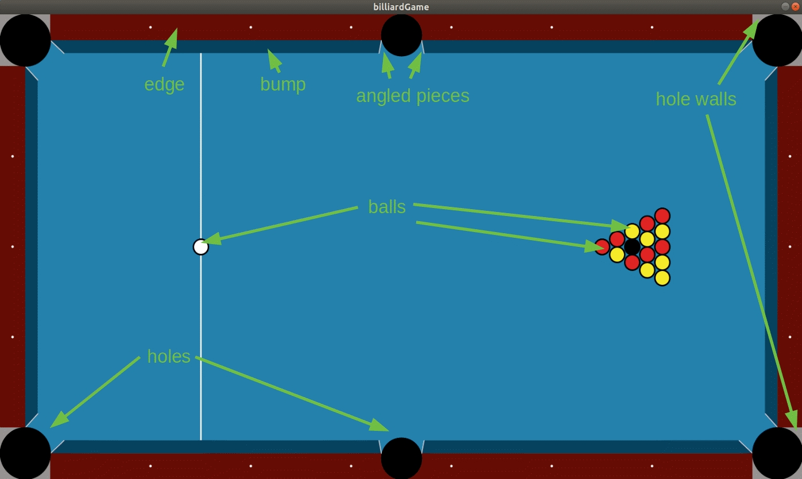
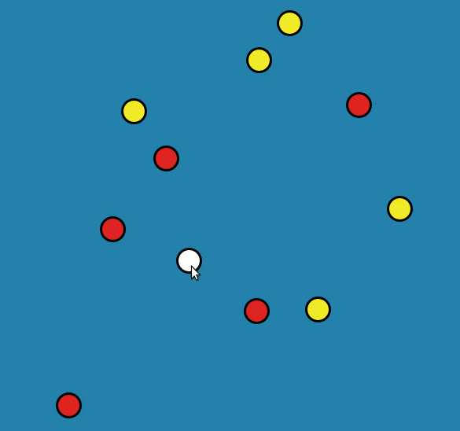
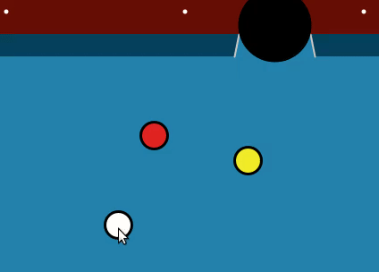
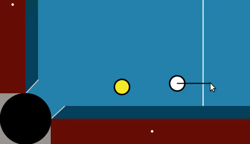

# BilliardGame
A two dimensional simulation in `Processing` that represents an actual billiard game/table. 

The program can be interacted by one or two players as to play a virtual pool game. 

The project focuses on the implementation of two dimensional physics in a game. Artistic emphasis was not the primary goal of this implementation. Visual effects were implemented to a minimal standard as to represent a 2D billiard table to a satisfactory level. Visual aesthetics such as lighting and white ball lining may be implemented in the future, if time permits.

The final product is inspired by a usual 2D billiard table found on the Web.

## Visualisation

The billiard layout is broken into fundamental billiard "pieces". These are shown in the picture below:

Each billiard piece is represented by primitive shapes in `Processing`. For example, **balls** and **holes** are represented by a **circles**, **edges** and **hole walls** are represented by **rectangles**, **bumps** are represented by **shapes** where every vertex is individually pin-pointed to the screen. **Angled pieces** are shown as **pixels** where corresponding vertices of a bump have been selected and the vector comprising the vertices has been discretised to find the correct pixels (more on this later).

## Physics
Every "object" of the billiard game, i.e. a shape that interacts with other shapes or is said to have *physics*, gets resolved into two steps when a collision has been found to occur. These two steps are **penetration resolution** and **collision resolution**. Both of these steps  are checked and performed in every simulation step before the objects are rendered to the screen.

The penetration step and collision resolution can be found for every object to object interaction under the Collision System, *collisionSystem.pde*. There are three interactions that need to be simulated to achieve a functioning billiard game, these are **Ball to Ball**, **Ball to Bump** and **Ball to Angled Piece** interactions.

### Ball to Ball Interaction
The ball to ball interaction is the most important interaction and defining aspect of this game. It is a sphere-sphere interaction or because we are in 2D, a *circle-cicle* interaction. Each ball can be though as a "particle" which has a circular shape and some mass. All balls have the same mass.

### Ball to Bump Interaction
The ball to bump interaction can be thought as a *circle-line* interaction. The circle is the ball and the line is the outer line of the bump object.

### Ball to Angled Piece Interaction
The ball to Angled Piece Interaction is a little bit more complicated than the rest. The angle piece comprises of a series of pixels, so this interaction can be thought as a circle-point interaction. The resolution direction is found using the normal of the gradient of the vector that connects the firsy vertex of the angled piece to the second.

