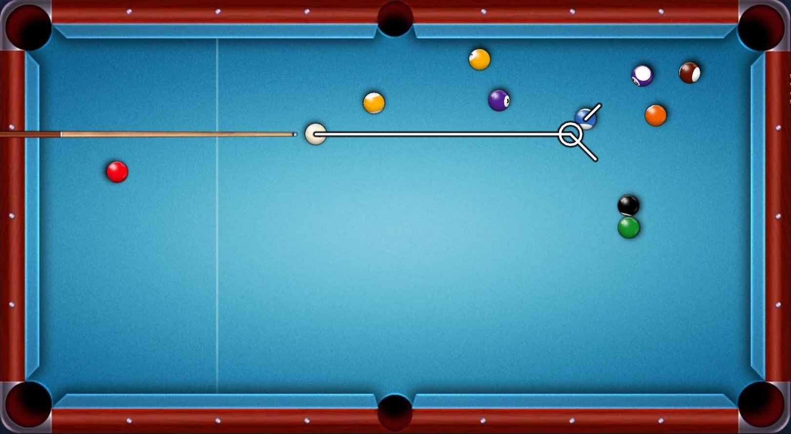

# BilliardGame
A two dimensional simulation in `Processing` that represents an actual billiard game/table. 

The program can be interacted by one or two players as to play a virtual pool game. 

The project focuses on the implementation of two dimensional physics in a game and artistic emphasis was not the primary goal of this implementation. Visual effects were implemented to a minimal standard as to represent a 2D billiard table to a satisfactory level. Visual aesthetics such as lighting and white ball lining may be implemented in the future, if time permits.

The final product is inspired by a usual 2D billiard table found on the Web.

## Visualisation

