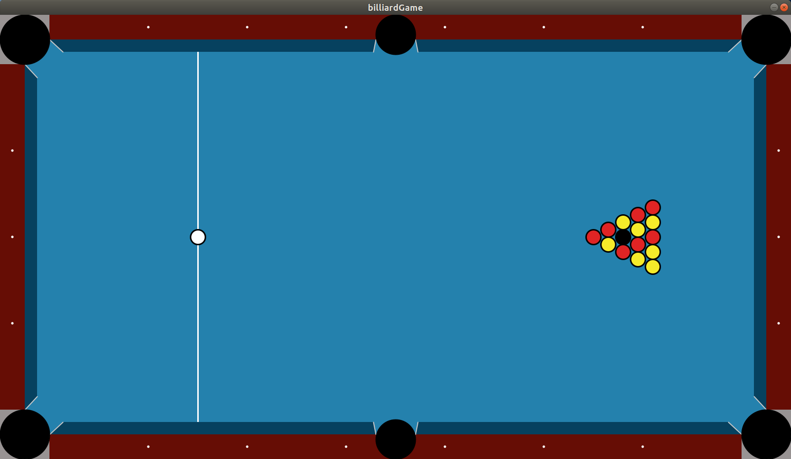

# BilliardGame
A two dimensional simulation in `Processing` that represents an actual billiard game/table. 

The program can be interacted by one or two players as to play a virtual pool game. Two dimensional physics have been written exclusively from scratch.

The final product is inspired by a usual billiard table found on the Web.

